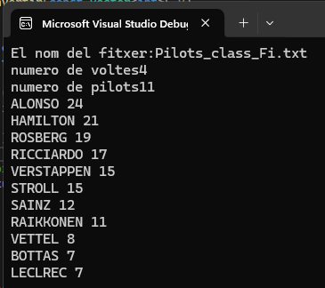

# Racing-Championship-Results-Analyzer
This Racing Championship Results Analyzer is a C++ project designed to read and analyze lap scores and pilot names from a data file. It calculates total points for each pilot based on predefined rules, sorts pilots based on total points, and displays the sorted list of pilots and their total points.

## Description

This project aims to provide a tool for analyzing racing results by reading data from a file, processing it, and presenting the results in a sorted format. It calculates total points for each pilot based on lap scores and sorts pilots based on their total points, providing a clear view of race rankings.

## Screenshots
- Grid View

- Full Image View
  

## Features

- Read racing data from a file
- Calculate total points for each pilot
- Sort pilots based on total points
- Display sorted rankings of pilots

## How to Use

1. Prepare a file containing racing data. Each line should contain the pilot's name followed by lap scores separated by spaces.
2. Run the application and provide the filename when prompted.
3. View the sorted rankings of pilots along with their total points.

## Installation

You can run the application by following these steps:
- Clone the repository to your local machine.
- Compile and run the code in a C++ environment.
- Provide a file containing racing data when prompted.
